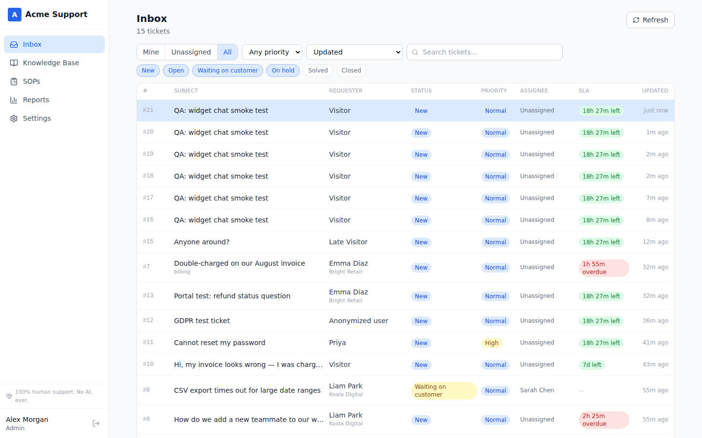
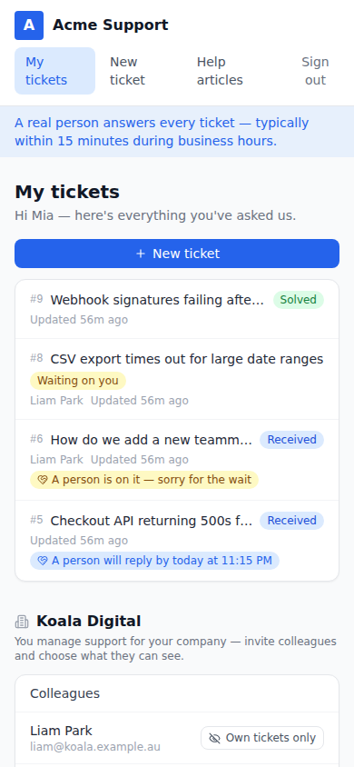
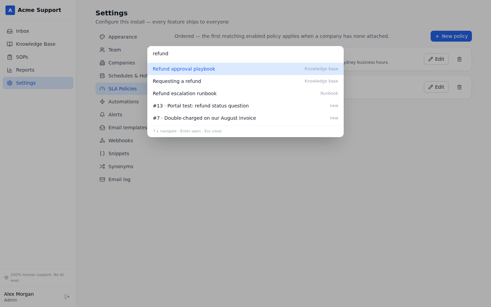
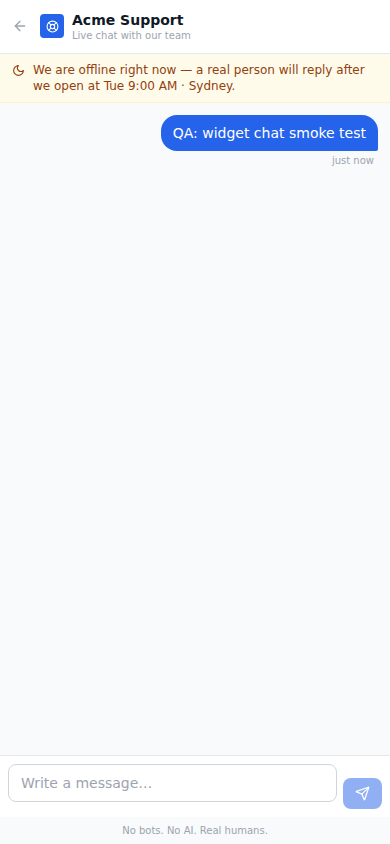

# Ultimate Support System

**A free, open-source, human-first support platform.** Submit a ticket — a real person gets back to you. No AI, no chatbots, ever. In a world where every support tool races to put a model between you and a human, this one guarantees the opposite: **the most human touch possible.**

Ticketing, knowledge base, SOPs/runbooks, customer portal, live chat, business-hours SLAs, reports — self-hosted in one container, fully white-label, licensed AGPL-3.0.

## The two pledges

1. **No AI, ever.** Every reply is written and signed by a named human. Auto-receipts are honestly labeled receipts. Search is classic engineering (Postgres full-text + trigram + synonyms — no embeddings). Customer data never touches a model.
2. **No open-core, ever.** There is nothing for sale, so there is nothing to gate. SLAs, SSO-ready auth, roles, versioning, reporting, white-label — everything ships to everyone, forever.

## Quick start

```bash
git clone https://github.com/pcykcul/ultimate-support-system
cd ultimate-support-system
docker compose up        # app + Postgres; http://localhost:3000
```

Or for local development:

```bash
npm install
cp .env.example .env     # defaults work; Postgres on localhost:5432
npm run db:migrate && npm run db:seed
npm run dev              # API + app on :3000
npm run dev:client       # optional: Vite dev server on :5173
```

Demo logins after seeding — staff: `admin@example.com / admin123`, `sarah@example.com / agent123`; customer portal: `mia@koala.example.au / customer123`. Surfaces: `/` staff app · `/portal` customer portal · `/help` public help center · `/widget` embeddable widget.

Outbound email: set `RESEND_API_KEY` ([Resend](https://resend.com)) **or** SMTP vars — with neither, emails are logged for dev.

## A look at it

| The inbox — SLA countdowns, breached tickets stay visible | The portal on a phone — visible human promises |
|---|---|
|  |  |

| Cmd+K — tickets, articles, runbooks in one palette | The widget — honest presence, no bots |
|---|---|
|  |  |

## What's inside

**Ticketing** — omnichannel inbox (email with real threading, portal, live chat, API), conversation view with public replies vs internal notes, collision-safe assignment, macros with snippet variables, merge, followers, full audit trail, keyboard-first triage (j/k, Cmd+K palette), and **the customer's local clock on every ticket** with an "it's 2am for them" compose warning.

**Business hours & SLAs** — named schedules in any IANA timezone with importable country holiday packs (AU/US/GB/NZ/CA), DST-safe math, SLA policies attachable to companies or matched by conditions, per-priority targets in business or calendar hours, documented pause semantics, pre-breach warnings, multi-level escalations, periodic-update sweeps, manual extension with audit, countdown badges, breach-first queue sorting, and attainment reporting. The customer sees the promise: *"A real person will reply by 9:15 AM Tuesday, Sydney time."*

**Knowledge base** — markdown editor with live preview, 3-level categories + tags, audience control per article (public / customers / specific companies / internal), revisions with rollback, draft→review→publish approval gate, owner verification loop with stale flags, reusable snippets, synonym-aware typo-tolerant search, zero-result queries feeding a "write this article" queue, one-click **draft-article-from-resolved-ticket**, and a content-health dashboard.

**SOPs & runbooks** — versioned procedures with step editors, runnable checklist instances with per-step audit trails, auto-start triggers on ticket state (SLA breach / priority / tags), macro-linked runbooks, and read-and-sign acknowledgment tracking with coverage dashboards and re-acknowledgment on new versions.

**Multi-tier users** — Admin / Supervisor / Agent / unlimited read-only Collaborators with scope control; Companies with domains, tiers, per-company SLA and schedule; a **customer-admin portal role** that manages company tickets, invites colleagues, and controls visibility. End users unlimited, always.

**Customer portal & help center** — branded portal with ticket history and visible human-reply promises, search-before-submit deflection that never gatekeeps ("No thanks, I want a human" is always one click), CSAT, gated KB; public help center with feedback loops; an **embeddable widget** with honest presence — "Real people online now" only when someone actually is.

**White-label & super-admin** — rebrand by configuration: name, logo, colors, font (curated self-contained stacks), help-center title, human promise, email sender; customizable email templates with variables and test-send; per-alert notification controls. No fork, survives every upgrade.

**Reports** — volume, response medians (honestly labeled), SLA attainment, CSAT, per-agent table, channel breakdown, day-by-day chart, and the deflection funnel.

**Operations** — CSV/JSON exports, logical backup endpoint, GDPR anonymization with audit record, signed webhooks, deterministic automation rules, REST API + event webhooks, no telemetry. See [`docs/development/operations.md`](docs/development/operations.md).

## Documentation

| | |
|---|---|
| [Product vision](docs/product/01-vision.md) | Why human-first + open source wins, product principles |
| [Feature spec](docs/product/02-feature-spec.md) | Module-by-module specification |
| [Architecture](docs/product/03-architecture.md) | Modular monolith, Postgres-for-everything, licensing |
| [Roadmap](docs/product/04-roadmap.md) | Phased plan and sequencing rationale |
| [Development conventions](docs/development/conventions.md) | Coding rules + the API contract |
| [Operations guide](docs/development/operations.md) | Backups, exports, GDPR, hardening |
| [Channel adapters](docs/development/channel-adapters.md) | Adding WhatsApp/SMS/Messenger |
| [Market research](docs/research/) | The 11 research reports this project is built on |

## Stack

TypeScript end to end. Fastify + Drizzle + PostgreSQL (search via `tsvector` + `pg_trgm` — no Elasticsearch, no vector store). React + Vite + Tailwind. One container + one database; < 1 GB RAM at small scale. No Redis required, no external services beyond your email provider.

## Contributing

See [CONTRIBUTING.md](CONTRIBUTING.md). The two pledges above are constitutional — everything else is open for discussion. Security reports: [SECURITY.md](SECURITY.md).

## License

[AGPL-3.0](LICENSE) — free forever, and derivatives that serve it over a network must share their source. That's what keeps "free means free" true at scale.
